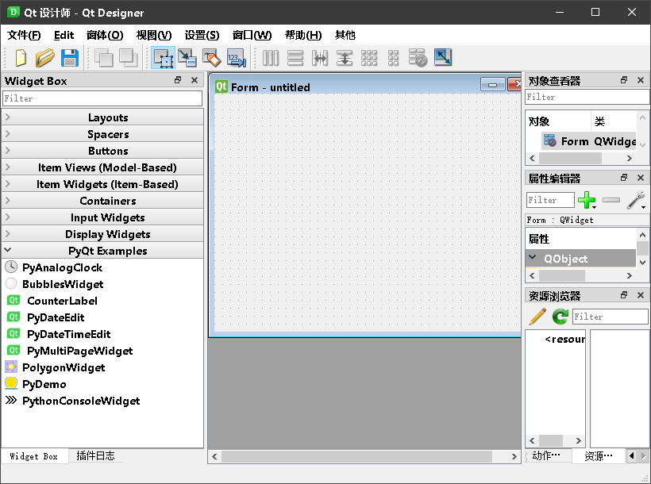
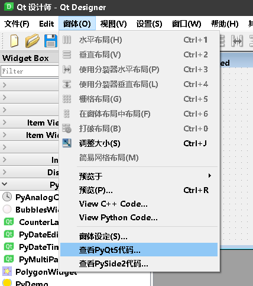
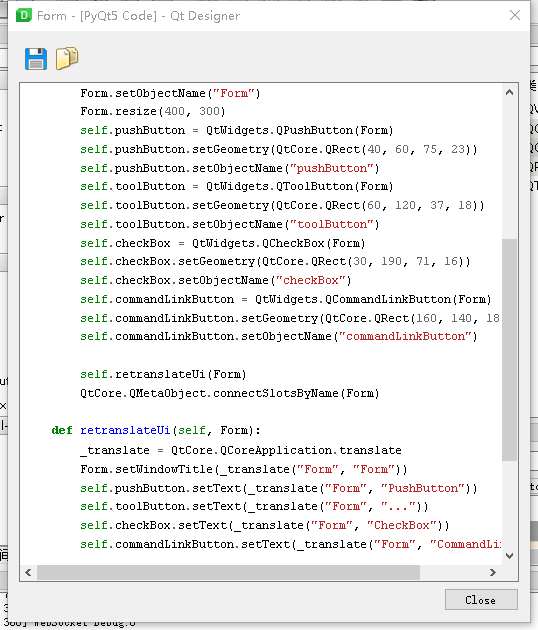
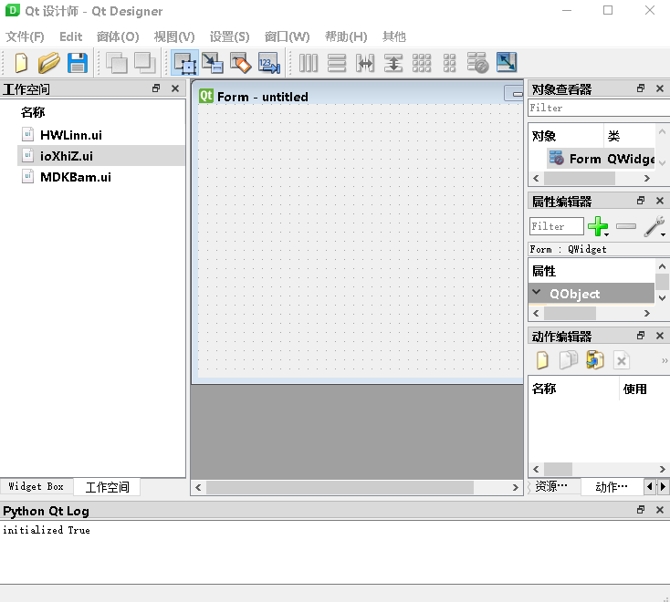
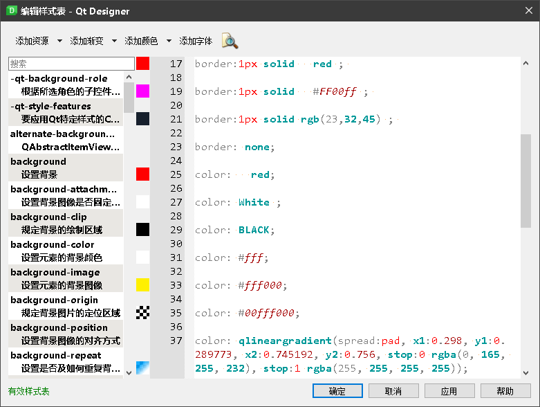
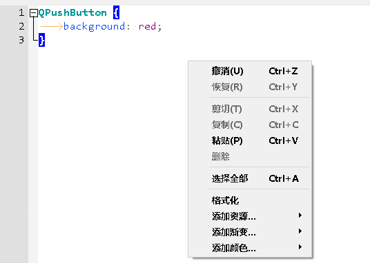
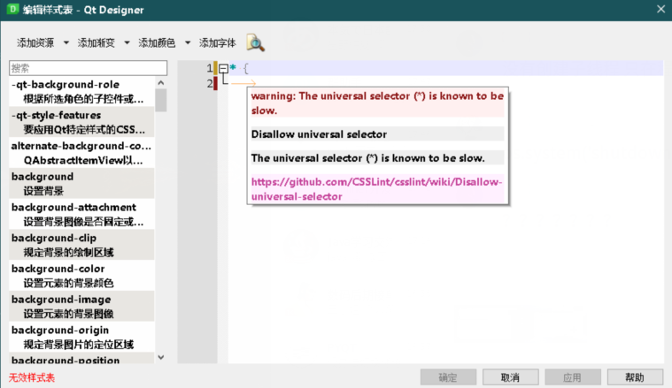

# Qt Designer Plugins

[gitee mirror](https://gitee.com/PyQt5/QtDesignerPlugins)

## Platform

1. [Windows](Windows)
2. [Linux](Linux)

## TODO

- [x] Log View 【日志窗口】
- [x] PyQt5 plug-in, you can use PyQt5 to write custom controls 【PyQt5 插件，可以通过 PyQt5 编写设计师自定义控件】
- [x] Style editor with auto-complete, QSS format, QSS lint 【QSS 编辑器优化】
- [x] Ui Files Workspace 【当前打开 UI 文件的工作空间】
- [ ] linguist.exe with multi language translation
- [ ] assistant.exe with translation

## Notice

1. For Linux platform needs to run `designer.sh` file and it will take a while to display.
2. If you want use `assistant`, You need to download the doc document from [https://github.com/PyQt5/QtDesigner/releases](https://github.com/PyQt5/QtDesigner/releases) and put it in the `Docs` folder, like `Windows/Docs/Qt-5.15.0` or `Linux/Docs/Qt-5.15.0`

3. Linux 版本下运行`designer.sh`启动设计师，不过可能有点慢
4. 如果想使用本地离线文档功能，则需要从[https://github.com/PyQt5/QtDesigner/releases](https://github.com/PyQt5/QtDesigner/releases) 下载 `Docs.tar.gz` 并解压到 `Windows/Docs` 或者 `Linux/Docs`

## Download

1. Qt Designer

https://github.com/PyQt5/QtDesigner/releases

https://gitee.com/PyQt5/QtDesigner/releases

2. Qt Designer Plugins

https://github.com/PyQt5/QtDesignerPlugins/releases

3. Install Plugins

Unpack Python.7z to QtDesigner

Unpack Designer.7z to QtDesigner

解压到 QtDesigner 下对应的 Linux 和 Windows 版本

## ScreenShot

PyQt5 Plugin

Workspace Plugin

QSS Editor Plugin

